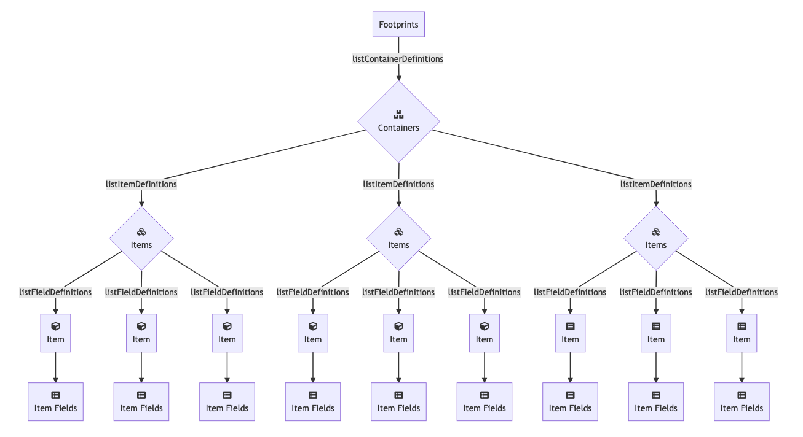

<h1 align="center">FootprintsAPI</h1>
<p align="center">A better Python wrapper for Footprints SOAP API.</p>

## What is this wrapper for?
This wrapper integrates with Footprint's SOAP endpoints. What is Footprints? Check it our [here](https://www.footprintsservicedesk.com/).

## Table of contents
- [Quick Start](#quick-start)
- [Local Deploy Steps](#local-deploy-steps)
- [Notes](#notes)
- [API Endpoints](#api-endpoints)
- [To Do](#to-do)

## Quick start

- Download the repo.
- Clone the repo: `https://github.com/Jesus-E-Rodriguez/footprintsapi.git`
- Add as a project dependency: `git+https://github.com/Jesus-E-Rodriguez/footprintsapi.git@vtag#`


## What's included

The download comes the following directories and files:
```
footprintsapi/
├── DEPLOY.md
├── LICENSE
├── env.py.example
├── footprintsapi
│   ├── __init__.py
│   ├── exceptions.py
│   ├── footprints.py
│   ├── mixins
│   │   ├── common.py
│   │   ├── get.py
│   │   ├── post.py
│   │   └── update.py
│   ├── models.py
│   ├── requester.py
│   └── utils.py
├── pip-selfcheck.json
├── requirements
│   ├── base.txt
│   ├── local.txt
│   └── test.txt
├── setup.py
├── test.py
└── tests
    ├── __init__.py
    ├── settings.py
    ├── test_requester.py
    ├── utils.py
    └── wsdl
        ├── externalapiservices.wsdl
        ├── externalapiservices_schema.xsd
        └── listContainerDefinitions.xml
```

## Local Deploy steps

Install the required dependencies:

        $ pip install -r requirements/local.txt

## Notes

Footprint's internal architecture is as follows:
<div></div>

An object oriented approach was taken with this project. As such, the SOAP endpoints are
called through the use of a `Footprints` Object.

Instantiate the object with the following attributes:

```python
from footprints import Footprints
import env as settings

attributes = {
    "client_id": settings.CLIENT_ID,
    "client_secret": settings.CLIENT_SECRET,
    "base_url": settings.BASE_URL
}

fp = Footprints(**attributes)
```

Example settings:
```
CLIENT_ID = "Agent username"
CLIENT_SECRET = "Agent password"
BASE_URL = "https://{Your hostname here}/footprints/servicedesk/externalapisoap/ExternalApiServicePort?wsdl"
```

Additional attributes can also be passed in as needed. When the object is instantiated 
with optional parameters, the functions that require those same parameters will automatically
use them if not passed in.

For testing purposes an example `wsdl` file has been included in `tests/wsdl/`. In order to get a deeper understanding of the Footprint's architecture the use of [SOAP UI](https://www.soapui.org/) is recommended.


## API Endpoints

Endpoint  | Method | Parameters (Bolded are required) | Returns | Additional Notes 
------------- | ------------- | ------------- | ------------- | ------------- 
*"createCI"* | `fp.create_ci(...)` | **cmdb_definition_id**, cifields, status, submitter | CI ID | **cmdb_definition_id** can be found using `fp.list_container_definitions()`
*"createContact"* | `fp.create_contact(...)` | **address_book_definition_id**, **contact_fields**, submitter | Contact ID |  **address_book_definition_id** can be found using `fp.list_container_definitions()`
*"createItem"* | `fp.create_item(...)` | **item_definition_id**, **item_fields**, quick_template_id, assignees, submitter | Contact ID | **item_definition_id** can be fetched by using `fp.list_container_definitions()`
*"createOrEditContact"* | `fp.create_or_edit_contact(...)` | **address_book_definition_id**, **contact_fields**, contact_id, submitter |  Contact ID | **address_book_definition_id** can be found using `fp.list_container_definitions()`
*"createTicket"* | `fp.create_ticket(...)` |  **ticket_definition_id**, **ticket_fields**, assignees, submitter, quick_template_id, contact_definition_id, select_contact | Ticket ID | **ticket_definition_id** can be found using `fp.list_item_definitions(container_definition_id)`. **ticket_definition_id** is only optional when it has already been passed into the `Footprints` ticket object.
| *"createTicketAndLinkAssets"* | `fp.create_ticket_and_link_assets(...)` | **ticket_definition_id**, **ticket_fields**, assets_list, assignees, submitter | Ticket ID | See `createTicket` additional notes |
*"editCI"* | `fp.update_ci(...)` | **cmdb_definition_id**, **ci_id**, ci_fields, status, submitter | CI ID | **cmdb_definition_id** can be found using `fp.list_container_definitions()`
*"editContact"* | `fp.update_contact(...)` | **address_book_definition_id**, **contact_id**, **contact_fields**, submitter | Contact ID | See `createContact` additional notes
*"editItem"* | `fp.update_item(...)` | **item_definition_id**, **item_id**, **item_fields**, assignees, submitter | Item ID | See `createItem` additional notes
*"editTicket"* | `fp.update_ticket(...)` | **ticket_definition_id**, **ticket_id**, **ticket_fields** , contact_definition_id, select_contact, assignees, submitter | Ticket ID | 
*"getContactAssociatedTickets"* | `fp.get_contact_associated_tickets(...)` | **contact_definition_id**, **primary_key_value**, submitter | Sea of Tickets | **contact_definition_id** can be found using `fp.get_container_definitions()` typically the container definition id you are looking for will have a sub type name of Address Book. With the proper id, use `fp.get_item_definitions(container_definition_id)` which will display the `contact_definition_id`.
*"getItemDetails"* | `fp.get_item(...)` | **item_definition_id**, **item_id**, fields_to_retrieve, submitter | Item Object | 
*"getItemId"* | `fp.get_item_id(...)` | **item_definition_id**, **item_number**, submitter | Item ID | The item id can optionally be prepended with your organizational prefix or left has a number. The organization prefix defaults to "SR-" upon object instantiation. 
*"getTicketDetails"* | `fp.get_ticket(...)` | **item_definition_id**, **item_number**, item_id, submitter, fields_to_retrieve | Ticket Object | The ticket object has all the returned ticket fields as attributes. As such common fields like the ticket title can be accessed by: <pre lang="python">print(ticket.title)</pre> You can modify the custom attributes that are included in the ticket object by modifying the `CustomAttributesMixin` found in: <pre lang="python">from footprints.mixins.common import CustomAttributesMixin</pre>
*"linkItems"* | `fp.link_items(...)` | **first_item_definition_id**, **first_item_id**, **second_item_definition_id**, **second_item_id**, **link_type_name**, submitter | Dynamic Item Link ID | No assumptions are made regarding the linking of items. Both item definition ids and their respective item ids must be passed in. The list of acceptable **link_type_name**(s) can be found within the method documentation.
*"linkTickets"* | `fp.link_tickets(...)` | **first_ticket_definition_id**, **first_ticket_id**, **second_ticket_definition_id**, **second_ticket_id**, **link_type_name**, submitter | Dynamic Item Link ID | See `linkItems` additional notes
*"listContainerDefinitions"* | `fp.get_container_definitions(...)` | container_subtype_name, submitter | List of container dictionaries | Use this function to get the definition ids of various workspaces
*"listItemDefinitions"* | `fp.get_item_definitions(...)` | item_definition_id, submitter | List of item dictionaries | Use this function to get the items within a workspace
*"listFieldDefinitions"* | `fp.get_field_definitions(...)` | item_definition_id, submitter | List of field dictionaries | Use this function to get the fields relevant to an item
*"listQuickTemplates"* | `fp.get_quick_templates(...)` |  item_definition_id, submitter | List of dictionaries |
*"listSearches"* | `fp.get_searches(...)` |  item_type_name, submitter | List of dictionaries | You can use this parameter to retrieve item name only from the existing Saved Searches in the FootPrints application.
*"runSearch"* | `fp.get_search(...)` | search_id, submitter | Dict | You can retrieve the item_type_name parameter to get the item ID to run the search query from the existing Saved Searches only. **Note: You must create Saved Searches in the FootPrints application before using the web service to run the search queries. You cannot create Saved Searches by using the web services.**

## To Do
Create functional tests.